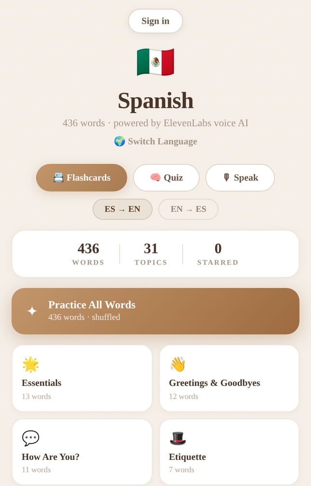
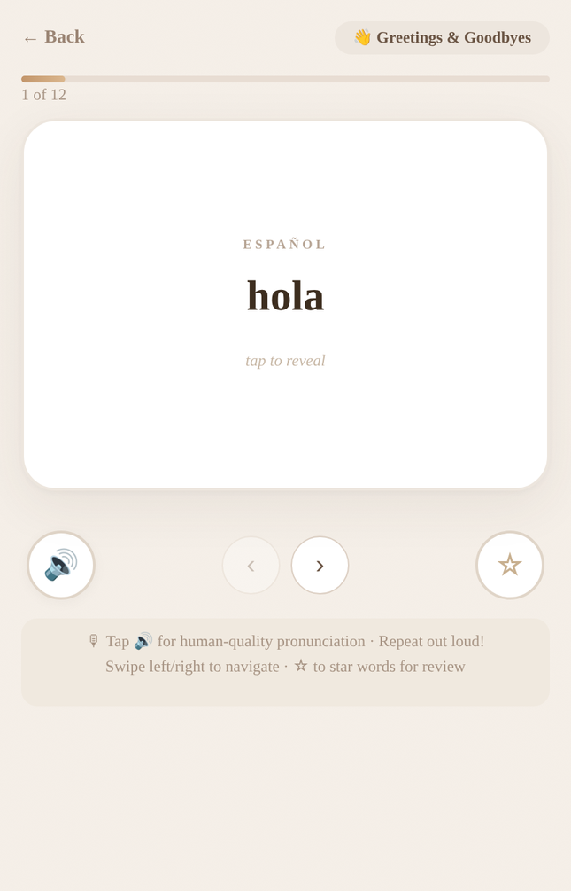
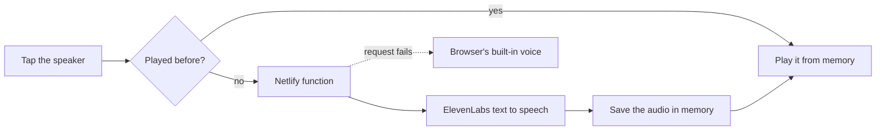

# My Words

A flashcard app for learning Spanish and Japanese, with pronunciation from ElevenLabs.

I wanted the words to sound like a person and not a robot. Every word in the app can be played out loud in a natural voice.

<p>
  
  
</p>

## What it does

- 436 Spanish words in 31 topics and 439 Japanese words in 25 topics
- Flashcards in either direction, with swipe to move between cards
- A quiz mode that keeps score and a streak
- A speak mode. You say the word, the browser listens, and the app scores how close you got.
- Stars for the words you want to come back to
- Sign in to save your stars and quiz scores. Your profile shows your strongest and weakest topics.

## How the voice works



The ElevenLabs key never reaches the browser. The app calls a small Netlify function in [`netlify/functions/tts.js`](netlify/functions/tts.js), and that function calls ElevenLabs with a key stored in Netlify's settings.

The function only takes POST requests and turns away any text over 500 characters. It uses the `eleven_multilingual_v2` model with one voice for Spanish and another for Japanese.

Each clip is kept in memory after the first play, so tapping the same word again doesn't call the API again. That lives in [`src/lib/tts.js`](src/lib/tts.js).

If the request fails for any reason, the app falls back to the browser's own speech in Mexican Spanish or Japanese. You get a worse voice, but the app keeps working.

## Built with

- React 19 and Vite
- ElevenLabs text to speech API
- Netlify Functions for the server side call, and Netlify for hosting
- Supabase for sign in and saved progress
- The browser's Web Speech API for speak mode

## Run it yourself

```bash
npm install
cp .env.example .env.local
```

Fill in `.env.local` with your ElevenLabs key and your Supabase project URL and anon key. Then:

```bash
npx netlify dev
```

`netlify dev` runs the app and the voice function together. Plain `npm run dev` works too, but the voice falls back to the browser's because the function isn't running.

Saved progress uses two Supabase tables:

| Table | Columns |
|---|---|
| `starred_words` | `user_id`, `word_key` |
| `quiz_scores` | `user_id`, `category`, `direction`, `hits`, `misses`, `created_at` |

## Things to know

Speak mode depends on the browser's speech recognition, which works in Chrome and not everywhere else. The app says so when it isn't available.
